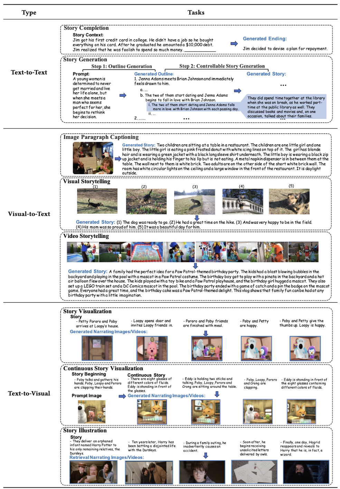

# Awesome-Story-Evaluation
We release a survey paper for story evaluation:[], providing a thorough review of story evaluation and existing evaluation methods that can be proposed or adopted for story evaluation.

In this repository, we introduce the main contents of our survey. We provide detailed collections of story generation/evaluation benchmarks, and correlated evaluation methods.

## Table of Contents
- [Introduction](#introduction)
- [Story Generation](#story-generation)
  - Tasks
  - Benchmarks
- [Story Evaluation](#papers)
  - Criteria
  - Benmarks
- [Metrics](#papers)
  - Traditional
  - LLM-Based
  - Collaborative
  - 

## Introduction
With the development of artificial intelligence, particularly the success of Large Language Models (LLMs), the quantity and quality of automatically generated stories have significantly increased. This has led to the need to explore automatic story evaluation to assess the generative capabilities of computing systems and analyze the quality of both automatic-generated and human-written stories. Evaluating a story can be more challenging than other generated text evaluation tasks. While tasks like language translation primarily focus on assessing the aspects of fluency and accuracy, story evaluation demands complex additional measures such as overall coherence, character development, interestingness, etc. This requires a thorough review of relevant research.
  In this survey, we first summarize existing storytelling tasks, including text-to-text, visual-to-text, and text-to-visual. We highlight their evaluation challenges, identify various human criteria to measure stories, and present existing benchmark datasets. Then, we propose a taxonomy to organize evaluation metrics that have been developed or can be adopted for story evaluation. We also provide descriptions of these metrics, along with the discussion of their merits and limitations. Later, we discuss the human-AI collaboration for story evaluation and  generation. Finally, we suggest potential future research directions, extending from story evaluation to general evaluations.

## Story Generation
### Tasks
 

   

 

### Benchmarks

|  Corpora  | Paper |   Data Source  |  Annotations | Correlated Task   |   Domain  |
|:--------|:--------:|:--------:|:--------:|:--------:|:--------:|
| Children's Books  | [Paper]() | [Download]() | Story Context, Query→Infilling Entity | Story Completion | Fairy Tale |
| CNN | [Paper]() |  [Download]() | Story Context, Query→Infilling Entity |  Story Completion |  News |
| Story Cloze Test  | [Paper]() |  [Download]() | Story Context→Ending  | Story Completion |  Commonsense |
| RocStories  | [Paper]() |  [Download]() | Title→Five-Sentence Story  | Story Generation |  Commonsense |
| NYTimes  | [Paper]() |  [Download]() | Title→Outline→Story  | Story Generation |  News |
| WritingPrompts |  [Paper]() | [Download]() | Prompt→Story  | Story Generation  | Real World |
| Mystery  | [Paper]() |  [Download]() | Outline→Story |  Story Generation |  Fiction |
| Fairy Tales  | [Paper]() |  [Download]() | Outline→Story  | Story Generation  | Fiction |
| Hippocorpus  |  [Paper]() | [Download]() | Prompt→Story  | Story Generation  | General |
| STORIUM  |  [Paper]() | [Download]() | Structural Prompt→Story  | Story Generation |  Fiction |
| TVSTORYGEN |  [Paper]() | [Download]() | Character Descriptions, Prompt→Story  | Story Generation  | TV Show |
| LOT | [Paper]() |  [Download]() | Title→Outline→Story  | Story Completion/Generation  | Fiction |
| GPT-BOOKSUM | [Paper]() | [Download]() | Outline→Story | Story/Plot Generation | Fiction |
| Image Paragraph | [Paper]() | [Download]() | Image→Story | Image Paragraph Captioning | Real World |
| Travel Blogs | [Paper]() | [Download]() |  Image→Story |  Visual Storytelling |  Real World |
| VIST | [Paper]() | [Download]() | Image Sequence→Story |  Visual Storytelling |  Real World |
| AESOP | [Paper]() | [Download]() | Image Sequence→Story |  Visual Storytelling |  Real World |
| Video Storytelling | [Paper](https://arxiv.org/pdf/1807.09418v3) | [Download](https://zenodo.org/records/2383739) | Video→Story |  Video Storytelling  | Real World |
| VWP | [Paper](https://aclanthology.org/2023.tacl-1.33.pdf) | [Download](https://vwprompt.github.io/) | Image Sequence→Story |  Visual Storytelling |  Movie |
| Album Storytelling | [Paper](https://arxiv.org/pdf/2305.12943) | - | Image Sequence→Story  | Visual Storytelling |  Real World |
| MUGEN | [Paper](https://arxiv.org/pdf/2204.08058) | [Download](https://mugen-org.github.io/data) | Story→Video |  Story Visualization |  Game |
| PororoSV | [Paper]() | [Download]() | Story→Image Sequence  | Story Visualization  | Cartoon |
| FlintstonesSV| [Paper]() | [Download]() | Story→Image Sequence  | Story Visualization  | Cartoon |
| DiDeMoSV | [Paper]() | [Download]() | Story→Image Sequence |  Story Visualization  | Real World |
| StorySalon | [Paper]() | [Download]() | Story→Image Sequence  | Story Visualization |  Animation |
| MovieNet-TeViS | [Paper]() | [Download]() | Story→Image Sequence  | Story Illustration  | Movie |
| CMD | [Paper]() | [Download]() | Story→Video Clip Sequence  | Story Illustration  | Movie |
| CVSV | [Paper]() | [Download]() | Story→Video Clip Sequence |  Story Illustration  | Movie |
| StoryBench | [Paper]() | [Download]() | Textual Story, Video Prompt→Video  | Continuous Story Visualization  | Real World |

## Papers
