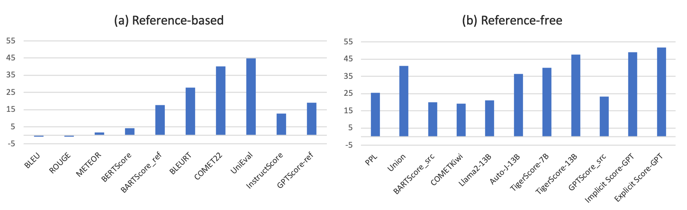

# Awesome-Story-Evaluation
🔥 We release a survey paper for story evaluation: [What Makes a Good Story? A Survey of Story Evaluation]().

🌟 In this repository, we introduce main contents in our survey, and provide detailed collections of:
- Story generation benchmarks
- Story evaluation benchmarks
- Metrics that are proposed or can be adopted for story evaluation.

✨ If you have any feedback or suggestions, please feel free to contact us at yangdingyi@ruc.edu.cn.

## Table of Contents
- [Introduction](#introduction)
- [Story Generation](#story-generation)
  - [Tasks](#tasks)
  - [Benchmarks](#benchmarks)
- [Story Evaluation](#papers)
  - [Criteria](#criteria)
  - [Benchmarks](#eval_benchmarks)
- [Metrics](#metrics)
  - [Traditional](#traditional)
    - [Lexical-Based](#lexical-based)
    - [Embedding-Based](#embedding-based)
    - [Probability-Based](#probability-based)
    - [Trained](#trained)
    - [Multi Modal](#multi-modal)
  - [LLM-Based](#LLM-based)
    - [Embedding-Based](#llm-embedding-based)
    - [Probability-Based](#llm-probability-based)
    - [Generative-Based](#llm-generative-based)
    - [Trained](#llm-trained)
  - [Collaborative](#Collaborative)
  - [Evaluating Metrics on Story Evaluation Benchmark](#performance)

## Introduction
With the development of artificial intelligence, particularly the success of Large Language Models (LLMs), the quantity and quality of automatically generated stories have significantly increased. This has led to the need to explore automatic story evaluation to assess the generative capabilities of computing systems and analyze the quality of both automatic-generated and human-written stories. Evaluating a story can be more challenging than other generated text evaluation tasks. While tasks like language translation primarily focus on assessing the aspects of fluency and accuracy, story evaluation demands complex additional measures such as overall coherence, character development, interestingness, etc. This requires a thorough review of relevant research.

  In our survey, we first summarize existing storytelling tasks, including text-to-text, visual-to-text, and text-to-visual. We highlight their evaluation challenges, identify various human criteria to measure stories, and present existing benchmark datasets. Then, we propose a taxonomy to organize evaluation metrics that have been developed or can be adopted for story evaluation. We also provide descriptions of these metrics, along with the discussion of their merits and limitations. Later, we discuss the human-AI collaboration for story evaluation and  generation. Finally, we suggest potential future research directions, extending from story evaluation to general evaluations.

## Story Generation

### Tasks

  <l><strong>Text2Text</strong></l> 
   
  <l><strong>Visual2Text</strong></l> 
   
  <l><strong>Text2Visual</strong></l> 
   

### Story Generation Benchmarks

|  Corpora  | Paper |   Data Source  |  Annotations | Correlated Task |   Domain  |
|:------------|:--------:|:--------:|:--------:|:------:|:--------:|
| Children's Books  | [Paper](http://arxiv.org/abs/1511.02301) | [Download](https://research.facebook.com/downloads/babi) | Story Context, Query→Infilling Entity | Story Completion | Fairy Tale |
| CNN | [Paper](https://proceedings.neurips.cc/paper/2015/hash/afdec7005cc9f14302cd0474fd0f3c96-Abstract.html) |  [Download](https://github.com/abisee/cnn-dailymail) | Story Context, Query→Infilling Entity |  Story Completion |  News |
| Story Cloze Test  | [Paper](https://doi.org/10.18653/v1/n16-1098) |  [Download](https://cs.rochester.edu/nlp/rocstories/) | Story Context→Ending  | Story Completion |  Commonsense |
| RocStories  | [Paper](https://doi.org/10.18653/v1/n16-1098) |  [Download](https://cs.rochester.edu/nlp/rocstories/) | Title→Five-Sentence Story  | Story Generation |  Commonsense |
| NYTimes  | [Paper](https://aclanthology.org/2020.emnlp-main.349.pdf) |  [Download](https://github.com/hrashkin/plotmachines/tree/master/src/preprocessing) | Title→Outline→Story  | Story Generation |  News |
| WritingPrompts |  [Paper](https://aclanthology.org/P18-1082.pdf) | [Download](https://www.kaggle.com/datasets/ratthachat/writing-prompts) | Prompt→Story  | Story Generation  | Real World |
| Mystery  | [Paper](https://arxiv.org/pdf/2001.10161) |  [Download](https://github.com/rajammanabrolu/WorldGeneration) | Outline→Story |  Story Generation |  Fiction |
| Fairy Tales  | [Paper](https://arxiv.org/pdf/2001.10161) |  [Download](https://github.com/rajammanabrolu/WorldGeneration) | Outline→Story  | Story Generation  | Fiction |
| Hippocorpus  |  [Paper](https://aclanthology.org/2020.acl-main.178/) | [Download](http://aka.ms/hippocorpus) | Prompt→Story  | Story Generation  | General |
| STORIUM  |  [Paper](https://aclanthology.org/2020.emnlp-main.525/) | [Download](https://github.com/dojoteef/storium-frontend) | Structural Prompt→Story  | Story Generation |  Fiction |
| TVSTORYGEN |  [Paper](https://arxiv.org/pdf/2109.08833) | [Download](https://github.com/mingdachen/TVRecap) | Character Descriptions, Prompt→Story  | Story Generation  | TV Show |
| LOT | [Paper](https://aclanthology.org/2022.tacl-1.25.pdf) |  [Download](https://github.com/thu-coai/LOT-LongLM) | Title→Outline→Story  | Story Completion/Generation  | Fiction |
| GPT-BOOKSUM | [Paper](https://aclanthology.org/2023.findings-emnlp.723.pdf) | [Download](https://github.com/YichenZW/Pacing) | Outline→Story | Story/Plot Generation | Fiction |
| Image Paragraph | [Paper](https://arxiv.org/pdf/1611.06607) | [Download](https://cs.stanford.edu/people/ranjaykrishna/im2p/index.html) | Image→Story | Image Paragraph Captioning | Real World |
| Travel Blogs | [Paper](https://proceedings.neurips.cc/paper_files/paper/2015/file/17e62166fc8586dfa4d1bc0e1742c08b-Paper.pdf) | [Download](https://github.com/cesc-park/CRCN/tree/master) |  Image→Story |  Visual Storytelling |  Real World |
| VIST | [Paper](https://aclanthology.org/N16-1147v2.pdf) | [Download](https://visionandlanguage.net/VIST/) | Image Sequence→Story |  Visual Storytelling |  Real World |
| AESOP | [Paper](https://ieeexplore.ieee.org/document/9710625) | [Download](https://github.com/adobe-research/aesop) | Image Sequence→Story |  Visual Storytelling |  Real World |
| Video Storytelling | [Paper](https://arxiv.org/pdf/1807.09418v3) | [Download](https://zenodo.org/records/2383739) | Video→Story |  Video Storytelling  | Real World |
| VWP | [Paper](https://aclanthology.org/2023.tacl-1.33.pdf) | [Download](https://vwprompt.github.io/) | Image Sequence→Story |  Visual Storytelling |  Movie |
| Album Storytelling | [Paper](https://arxiv.org/pdf/2305.12943) | - | Image Sequence→Story  | Visual Storytelling |  Real World |
| MUGEN | [Paper](https://arxiv.org/pdf/2204.08058) | [Download](https://mugen-org.github.io/data) | Story→Video |  Story Visualization |  Game |
| PororoSV | [Paper](https://openaccess.thecvf.com/content_CVPR_2019/papers/Li_StoryGAN_A_Sequential_Conditional_GAN_for_Story_Visualization_CVPR_2019_paper.pdf) | [Download](https://github.com/yitong91/StoryGAN) | Story→Image Sequence  | Story Visualization  | Cartoon |
| FlintstonesSV| [Paper](https://arxiv.org/pdf/1804.03608) | [Download](https://drive.google.com/file/d/1kG4esNwabJQPWqadSDaugrlF4dRaV33_/view) | Story→Image Sequence  | Story Visualization  | Cartoon |
| DiDeMoSV | [Paper](https://www.ecva.net/papers/eccv_2022/papers_ECCV/papers/136970070.pdf) | [Download](https://drive.google.com/file/d/1zgj_bpE6Woyi-G76axF0nO-yzQaLBayc/view) | Story→Image Sequence |  Story Visualization  | Real World |
| StorySalon | [Paper](https://arxiv.org/abs/2306.00973) | [Download](https://github.com/haoningwu3639/StoryGen) | Story→Image Sequence  | Story Visualization |  Animation |
| MovieNet-TeViS | [Paper](https://doi.org/10.1145/3581783.3612417) | [Download](https://github.com/guxu313/TeViS) | Story→Image Sequence  | Story Illustration  | Movie |
| CMD | [Paper](https://openaccess.thecvf.com/content/ACCV2020/papers/Bain_Condensed_Movies_Story_Based_Retrieval_with_Contextual_Embeddings_ACCV_2020_paper.pdf) | [Download](https://github.com/m-bain/CondensedMovies) | Story→Video Clip Sequence  | Story Illustration  | Movie |
| CVSV | [Paper](https://doi.org/10.1109/TMM.2023.3296944) | [Download](https://nfy-dot.github.io/CVSV-dataset/) | Story→Video Clip Sequence |  Story Illustration  | Movie |
| StoryBench | [Paper](https://arxiv.org/abs/2308.11606) | [Download](https://github.com/google/storybench) | Textual Story, Video Prompt→Video  | Continuous Story Visualization  | Real World |

## Story Evaluation

### Criteria
- **Relevance/Faithfulness (REL):** Whether the story is relevant to and accurately reflects the source input. (Text-to-Visual tasks measure whether the visual story matches the textual story).
- **Diversity (DIV):** Whether the stories generated by one model have many variations.
- **Fluency (FLU):** Whether the individual sentences within a story are of high quality, are they grammatically correct, non-repetitive, and in accord with common language usage.
  - **Grammaticality:** Whether the individual sentences are grammatically correct without lexical or syntax errors, regardless of the content and meaning.
  - **Non-redundancy:** Whether the individual sentences are free of redundant elements, such as repetition, over-specificity, etc.
- **Simplicity/Clarity (SIM):** Whether the story is clear and easy to understand, with no confusing or ambiguous elements.
- **Coherence (COH):** Whether all sentences and plots are well structured, with the context organized and connected logically.
While evaluating the coherence, try to ignore grammar or spelling errors.
  - **Cohesive:**  Whether the sentences in a story are formally connected. They can be connected by either a referential link
(co-reference, bridging anaphora) or by a semantic connector.
  - **Consistency:**  Whether the sentences are logically aligned with the preceding story.
  - **Implicit Relevance:**  Whether a story follows the same topic from beginning to end.
- **Completeness (COM):** Whether the story covers all the underlying concepts, theories, and historical context.
  - **Ending:**  Whether the story has a clear and good ending.
- **Informativeness/Complexity (INF):**  Whether the story contains rich, detailed and professional information to support its progression and world-building.
- **Commonsense (COMM):**  Whether the story adheres to commonsense knowledge, such as physical entities and social interactions.
- **Character Development (CHA):**  Whether the story features well-developed and engaging characters that are believable, relatable, and
contribute to the overall narrative or theme.
- **Interestingness/Engagement (INT):**  Whether the story is highly enjoyable or entertaining to read, with rich details and descriptions that engage
the reader’s senses and imagination.
- **Empathy (EMP):**  Whether the story arouses the readers’ empathy for the writer or the characters.
- **Surprise (SUP):**  Whether the story contains some suspense and surprise, especially in suspense stories.

### Story Evaluation Benchmarks
|  Corpora  | Paper |   Data Source  | Format | Criteria | Aspects | #Stories | #Samples |
|:------------|:--------:|:--------:|:--------:|:--------:|:------:|:------:|:------:|
| OpenMEVA | [Paper]() | [Download]() | Rating Scale (1-5)  | Overall | REL, FLU, COH, COMM | 2,000|  2,000| 
| HANNA  |[Paper]() | [Download]() |  Rating Scale (1-5)  | Single  | REL, COH, EMP, SUP, INT, INF | 1,056|  19,008| 
| VHED  | [Paper]() | [Download]() | Comparison  | Overall |  FLU, COH, SIM, REL | 4,500 | 13,875| 
| StoryER-Rank  | [Paper]() | [Download]() | Comparison  | Overall|  - | 63,929 | 116,971| 
| StoryER-Rate  | [Paper]() | [Download]() | Rating Scale (1-5)  | Single|  COH, STY, EMP | 12,669 | 45,948| 
| Per-MPST  | [Paper]() | [Download](https://github.com/facebookresearch/PerSE) | Comparison  | Overall|  - | 981 | 69,947 |
| Per-DOC | [Paper]() | [Download](https://github.com/facebookresearch/PerSE) | Rating Scale (1-5)  |  Single | INT, ADAP, SUR, CHA, END | 596 | 8,922| 
| Xie  | [Paper]() | [Download]() | Rating Scale (1-5)  | Single|  REL, FLU, COH, COMM, INT|  200 | 1,000| 
| COHESENTIA | [Paper]() | [Download]() | Rating Scale (1-5)  | Single | COH | 500|  500 | 

## Metrics
Taxonomy of evaluation metrics proposed or can be adopted for story evaluation. These specifically proposed for story
evaluation are colored.

   

### Traditional Evaluation

#### Lexical-Based
|  Metric  | Paper |  Venue	| Date |
|:------|:--------:|:--------:|:--------:|
| BLEU | [Bleu: a Method for Automatic Evaluation of Machine Translation](https://aclanthology.org/P02-1040/) | ACL | 2002 |
| ROUGE| [Rouge: A package for automatic evaluation of summaries](https:/www.aclweb.org/W04-1013) | ACL | 2004 |
| METEOR | [METEOR: An Automatic Metric for MT Evaluation with Improved Correlation with Human Judgments](https://aclanthology.org/W05-0909/) | ACL | 2005 |
| CIDEr| [CIDEr: Consensus-based image description evaluation](https://doi.org/10.1109/CVPR.2015.7299087) | CVPR | 2015 |
| Backward BLEU| [Toward Diverse Text Generation with Inverse Reinforcement Learning](https://doi.org/10.24963/ijcai.2018/606) | IJCAI | 2018 |
| MS-Jaccard | [Jointly measuring diversity and quality in text generation models](https://arxiv.org/abs/1904.03971) | NAACL Workshop | 2019 |
| Distinct-n | [A Diversity-Promoting Objective Function for Neural Conversation Models](https://doi.org/10.18653/v1/n16-1014) | NAACL | 2016 |
| Self-BLEU | [Texygen: A Benchmarking Platform for Text Generation Models](https://doi.org/10.1145/3209978.3210080) | SIGIR | 2018 |
| **Inter-Story Repetition** | [Content Planning for Neural Story Generation with Aristotelian Rescoring](https://doi.org/10.18653/v1/2020.emnlp-main.351) | EMNLP | 2020 |
| **Intra-story Repetition** | [Plan-and-Write: Towards Better Automatic Storytelling](https://doi.org/10.1609/aaai.v33i01.33017378) | AAAI | 2019 |
| Repetition Percentage | [Long and Diverse Text Generation with Planning-based Hierarchical Variational Model](https://doi.org/10.18653/v1/D19-1321) | EMNLP | 2019 |
| **Unique Verbs** | [Strategies for Structuring Story Generation](https://doi.org/10.18653/v1/p19-1254) | ACL | 2019 |
| **Diverse Verbs** | [Strategies for Structuring Story Generation](https://doi.org/10.18653/v1/p19-1254) | ACL | 2019 |
| **Coverage** | [A Knowledge-Enhanced Pretraining Model for Commonsense Story Generation](https://aclanthology.org/2020.tacl-1.7/) | TACL | 2020 |
| TAACO | [The tool for the automatic analysis of text cohesion (TAACO): Automatic assessment of local, global, and text cohesion](https://doi.org/10.3758/s13428-015-0651-7) | BRM | 2016 |

#### Embedding-Based
|  Metric  | Paper |  Venue	| Date |
|:------|:--------:|:--------:|:--------:|
| ROUGE-WE | [Better Summarization Evaluation with Word Embeddings for ROUGE](https://doi.org/10.18653/v1/d15-1222) | EMNLP | 2015 |
| WMD | [From Word Embeddings To Document Distances](http://proceedings.mlr.press/v37/kusnerb15.html) | ICML | 2015 |
| SMS | [Sentence Mover's Similarity: Automatic Evaluation for Multi-Sentence Texts](https://doi.org/10.18653/v1/p19-1264) | ACL | 2019 |
| S+WMS | [Sentence Mover's Similarity: Automatic Evaluation for Multi-Sentence Texts](https://doi.org/10.18653/v1/p19-1264) | ACL | 2019 |
| BERTScore | [BERTScore: Evaluating Text Generation with BERT](https://openreview.net/forum?id=SkeHuCVFDr) | ICLR | 2020 |
| MoverScore | [MoverScore: Text Generation Evaluating with Contextualized Embeddings and Earth Mover Distance](https://doi.org/10.18653/v1/D19-1053) | EMNLP | 2019 |
| BaryScore | [Automatic Text Evaluation through the Lens of Wasserstein Barycenters](https://aclanthology.org/2021.emnlp-main.817/) | EMNLP | 2021 |
| DepthScore | [A pseudo-metric between probability distributions based on depth-trimmed regions](https://arxiv.org/abs/2103.12711) | arXiv | 2024  |
| InfoLM | [InfoLM: A New Metric to Evaluate Summarization \& Data2Text Generation](https://arxiv.org/pdf/2112.01589) | AAAI | 2022 |
| **BERTScore-Source** | [How interesting and coherent are the stories generated by a large-scale neural language model? Comparing human and automatic evaluations of machine-generated text](https://doi.org/10.1111/exsy.13292) | EXPERT SYST | 2023 |
| TAACO 2.0  | [The Tool for the Automatic Analysis of Cohesion 2.0: Integrating semantic similarity and text overlap](https://doi.org/10.3758/s13428-018-1142-4) | BRM | 2019 |

#### Probability-Based
|  Metric  | Paper |  Venue	| Date |
|:------|:--------:|:--------:|:--------:|
| Perplexity | [A Maximum Likelihood Approach to Continuous Speech Recognition](https://doi.org/10.1109/TPAMI.1983.4767370) | TPAMI | 1983 |
| BARTScore | [BARTScore: Evaluating Generated Text as Text Generation](https://proceedings.neurips.cc/paper/2021/hash/e4d2b6e6fdeca3e60e0f1a62fee3d9dd-Abstract.html) | NeurIPS | 2021 |
|  CTRLEval | [CTRLEval: An Unsupervised Reference-Free Metric for Evaluating Controlled Text Generation](https://doi.org/10.18653/v1/2022.acl-long.164) | ACL | 2022 |

#### Trained
|  Metric  | Paper |  Venue	| Date |
|:------|:--------:|:--------:|:--------:|
| BLEURT | [BLEURT: Learning Robust Metrics for Text Generation](https://doi.org/10.18653/v1/2020.acl-main.704) | ACL | 2020 |
| COMET | [COMET: A Neural Framework for MT Evaluation](https://doi.org/10.18653/v1/2020.emnlp-main.213) | EMNLP | 2020 |
| COMET22 | [COMET-22: Unbabel-IST 2022 Submission for the Metrics Shared Task](https://aclanthology.org/2022.wmt-1.52) | ACL | 2022 |
| COMETKiwi | [CometKiwi: IST-Unbabel 2022 Submission for the Quality Estimation Shared Task](https://aclanthology.org/2022.wmt-1.60.pdf) | WMT | 2022 |
| MAUVE | [MAUVE: Measuring the Gap Between Neural Text and Human Text using Divergence Frontiers](https://proceedings.neurips.cc/paper/2021/hash/260c2432a0eecc28ce03c10dadc078a4-Abstract.html) | NeurIPS | 2021 |
| **Union** | [UNION: An Unreferenced Metric for Evaluating Open-ended Story Generation](https://doi.org/10.18653/v1/2020.emnlp-main.736) | EMNLP | 2020 |
| **MANPLTS** | [Plot-guided Adversarial Example Construction for Evaluating Open-domain Story Generation](https://doi.org/10.18653/v1/2021.naacl-main.343) | NAACL | 2021 |
| **Next Sentence Prediction** | [How interesting and coherent are the stories generated by a large-scale neural language model? Comparing human and automatic evaluations of machine-generated text](https://doi.org/10.1111/exsy.13292) | EXPERT SYST | 2023 |
| **Ending ACC** | [LongStory: Coherent, Complete and Length Controlled Long story Generation](https://aclanthology.org/2022.tacl-1.25.pdf) | PAKDD | 2024 |
| RUBER | [RUBER: An Unsupervised Method for Automatic Evaluation of Open-Domain Dialog Systems](https://doi.org/10.1609/aaai.v32i1.11321) | AAAI | 2018 |
| RUBER-BERT | [Better automatic evaluation of open-domain dialogue systems with contextualized embeddings](https://aclanthology.org/W19-2310/) | NAACL | 2019 |

#### Multi-Modal Evaluation
|  Metric  | Paper |  Venue	| Date |
|:------|:--------:|:--------:|:--------:|
| R-Precision | [StoryGAN: A Sequential Conditional GAN for Story Visualization](https://openaccess.thecvf.com/content_CVPR_2019/papers/Li_StoryGAN_A_Sequential_Conditional_GAN_for_Story_Visualization_CVPR_2019_paper.pdf) | CVPR | 2019 |
| Visual Captioning Accuracy | [Improving Generation and Evaluation of Visual Stories via Semantic Consistency](https://doi.org/10.18653/v1/2021.naacl-main.194) | NAACL | 2021 |
| ClipScore | [CLIPScore: A Reference-free Evaluation Metric for Image Captioning](https://doi.org/10.18653/v1/2021.emnlp-main.595) | EMNLP | 2021 |
| EMScore | [EMScore: Evaluating Video Captioning via Coarse-Grained and Fine-Grained Embedding Matching](https://doi.org/10.1109/CVPR52688.2022.01740) | CVPR | 2022 |
| **RoViST** | [RoViST: Learning Robust Metrics for Visual Storytelling](https://doi.org/10.18653/v1/2022.findings-naacl.206) | NAACL | 2022 |
| **GROOViST** | [GROOViST: A Metric for Grounding Objects in Visual Storytelling](https://doi.org/10.18653/v1/2023.emnlp-main.202) | EMNLP | 2023 |
| **Character Accuracy** | [StoryGAN: A Sequential Conditional GAN for Story Visualization](https://openaccess.thecvf.com/content_CVPR_2019/papers/Li_StoryGAN_A_Sequential_Conditional_GAN_for_Story_Visualization_CVPR_2019_paper.pdf) | CVPR | 2019 |
| **Character F1-Score** | [Improving Generation and Evaluation of Visual Stories via Semantic Consistency](https://doi.org/10.18653/v1/2021.naacl-main.194) | NAACL | 2021 |
| **Background Accuracy**  | [Make-A-Story: Visual Memory Conditioned Consistent Story Generation](https://doi.org/10.1109/CVPR52729.2023.00246) | CVPR | 2023 |
| **Background F1-Score** | [Make-A-Story: Visual Memory Conditioned Consistent Story Generation](https://doi.org/10.1109/CVPR52729.2023.00246) | CVPR | 2023 |

### LLM-Based Evaluation

#### Embedding-Based
|  Metric  | Paper |  Venue	| Date |
|:------|:--------:|:--------:|:--------:|
|  CosineSimilarity-ada-002| [RAGAs: Automated Evaluation of Retrieval Augmented Generation](https://aclanthology.org/2024.eacl-demo.16) | EACL | 2024 |

#### Probability-Based
|  Metric  | Paper |  Venue	| Date |
|:------|:--------:|:--------:|:--------:|
| GPTScore | [Gptscore: Evaluate as you desire](https://arxiv.org/abs/2302.04166) | NAACL | 2024 |
| **DELTASCORE** | [Deltascore: Fine-grained story evaluation with perturbations](https://arxiv.org/abs/2303.08991) | EMNLP | 2023 |
| Likelihood-Bias-Mitigation | [Likelihood-based Mitigation of Evaluation Bias in Large Language Models](https://arxiv.org/abs/2402.15987) | arXiv |2024 |

#### Generative-Based
|  Metric  | Paper |  Venue	| Date |
|:------|:--------:|:--------:|:--------:|
| PORTIA | [Split and merge: Aligning position biases in large language model based evaluators](https://arxiv.org/pdf/2310.01432) |arXiv |2023 |
| FairEval | [Large language models are not fair evaluators](https://arxiv.org/abs/2305.17926) | arXiV |2023 |
| BSM | [Branch-Solve-Merge Improves Large Language Model Evaluation and Generation](https://aclanthology.org/2024.naacl-long.462.pdf) | NAACL| 2024 |
| WideDeep | [Wider and deeper llm networks are fairer llm evaluators](https://arxiv.org/abs/2308.01862) | arXiv |2023 |
| COAScore | [CoAScore: Chain-of-Aspects Prompting for NLG Evaluation](https://arxiv.org/pdf/2312.10355v1) | arXiv |2023 |
| CheckEval| [CheckEval: Robust Evaluation Framework using Large Language Model via Checklist](https://arxiv.org/abs/2403.18771) |arXiv |2024 |
| ChatEval | [Chateval: Towards better llm-based evaluators through multi-agent debate](https://openreview.net/pdf?id=FQepisCUWu) | ICLR | 2024 |
| MATEval | [MATEval: A Multi-Agent Discussion Framework for Advancing Open-Ended Text Evaluation](https://arxiv.org/abs/2403.19305) |arXiv |2024 |
| Bai | [Benchmarking Foundation Models with Language-Model-as-an-Examiner](https://openreview.net/pdf?id=IiRHQ7gvnq) |NeurIPS | 2023|
| SCALEEVAL | [Can Large Language Models be Trusted for Evaluation? Scalable Meta-Evaluation of LLMs as Evaluators via Agent Debate](https://arxiv.org/pdf/2401.16788) |arXiv |2024 |

#### Trained
|  Metric  | Paper |  Venue	| Date |
|:------|:--------:|:--------:|:--------:|
| UniEval | [Towards a Unified Multi-Dimensional Evaluator for Text Generation](https://doi.org/10.18653/v1/2022.emnlp-main.131) | EMNLP | 2022 |
| T5Score | [T5Score: Discriminative Fine-tuning of Generative Evaluation Metrics](https://doi.org/10.18653/v1/2023.findings-emnlp.1014) | EMNLP| 2023|
| PandaLM | [PandaLM: An Automatic Evaluation Benchmark for LLM Instruction Tuning Optimization](https://doi.org/10.48550/arXiv.2306.05087) |ICLR | 2024|
| Prometheus | [Prometheus: Inducing Fine-grained Evaluation Capability in Language Models](https://arxiv.org/abs/2310.08491) |ICLR | 2024|
| Shepherd | [Shepherd: A critic for language model generation](https://arxiv.org/abs/2308.04592) | arXiV| 2023|
| Auto-J  | [Generative judge for evaluating alignment](https://arxiv.org/abs/2310.05470) | ICLR | 2024|
| CritiqueLLM | [CritiqueLLM: Towards an Informative Critique Generation Model for Evaluation of Large misc Model Generation](https://arxiv.org/abs/2311.18702v2) | ACL | 2024 |
| JudgeLM | [Judgelm: Fine-tuned large language models are scalable judges](https://arxiv.org/abs/2310.17631) |arXiV | 2023 |
| TIGERScore | [TIGERScore: Towards Building Explainable Metric for All Text Generation Tasks](https://arxiv.org/abs/2310.00752) |TMLR |2024|
| **COHESENTIA** | [COHESENTIA: A Novel Benchmark of Incremental versus Holistic Assessment of Coherence in Generated Texts](https://aclanthology.org/2023.emnlp-main.324/)) | EMNLP | 2023|
| **PERSE** | [Learning Personalized Story Evaluation](https://openreview.net/pdf?id=7AS7vaVU8d) |arxiV | 2024|

### Collaborative Evaluation
|  Metric  | Paper |  Venue	| Date |
|:------|:--------:|:--------:|:--------:|
| COEVAL | [Collaborative Evaluation: Exploring the Synergy of Large Language Models and Humans for Open-ended Generation Evaluation](https://arxiv.org/abs/2310.19740) | arXiv | 2023 |
| EvalLM| [EvalLM: Interactive Evaluation of Large Language Model Prompts on User-Defined Criteria](https://arxiv.org/abs/2309.13633) | arXiv | 2023 |

### Evaluating Metrics on Story Evaluation Benchmark
We present the evaluation performance of existing automatic metrics on the story evaluation benchmark. We focus on the most commonly used metrics and those demonstrating exceptional performance. 

🌟 More discussions can be found in Section 7 of our survey.

   
  <l>The Person Correlation results of popular and LLM-based powerful metrics on OpenMEVA evaluation dataset.</l>

